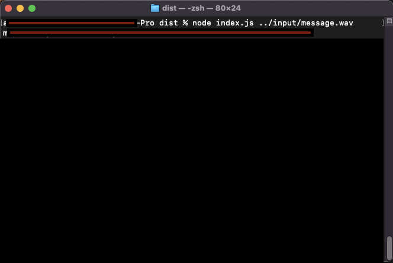
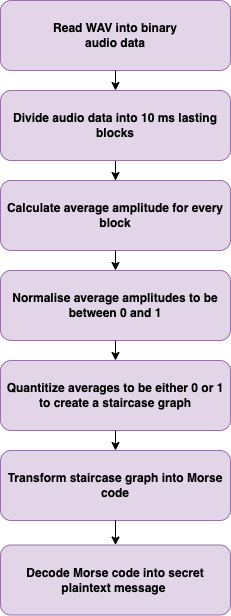

# wav-to-morse
Finds Morse code inside of WAV file and prints it.

NOTE: If no Morse code like sounds are found, empty string is returned.

  <kbd>
    
  </kbd>

## Description

This Node.js command line script takes WAV file as input and tries to find Morse code from inside of it. It outputs the finding as a string to console (blurred in the above picture).

### Built with

- Node.js
- TypeScript
- Unit testing with Jest
- ESLint static linter

## Getting started

### Prerequisites

This has been mostly tested with MacOS and Node.js 14.17.0.

### Install

Install node modules by running command `npm install`

### Build

Just build TypeScript files into dist folder by command `npm run build`

### Usage

Build and execute by running `npm start`. This will decode the secret inside the input/message.wav file.

After building, script can be run in `dist` folder by command `node index.js ../input/message.wav`

### Unit testing

Critical parts of code have been unit tested with Jest. To run the unit tests, run command `npm test`. In VSCode, it is also possible to debug unit tests by using `Jest current file` debug command. To run tests in watch mode, use command `npm run test:watch`.

### ESLint

Lint errors can be checked by running command `npm run lint`.

## Algorithm

Following diagram explains the process how Morse code is decoded from WAV file.

  <kbd>
    
  </kbd>

